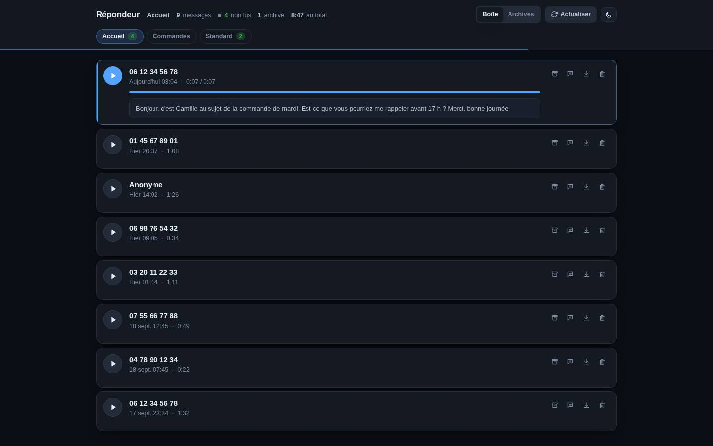
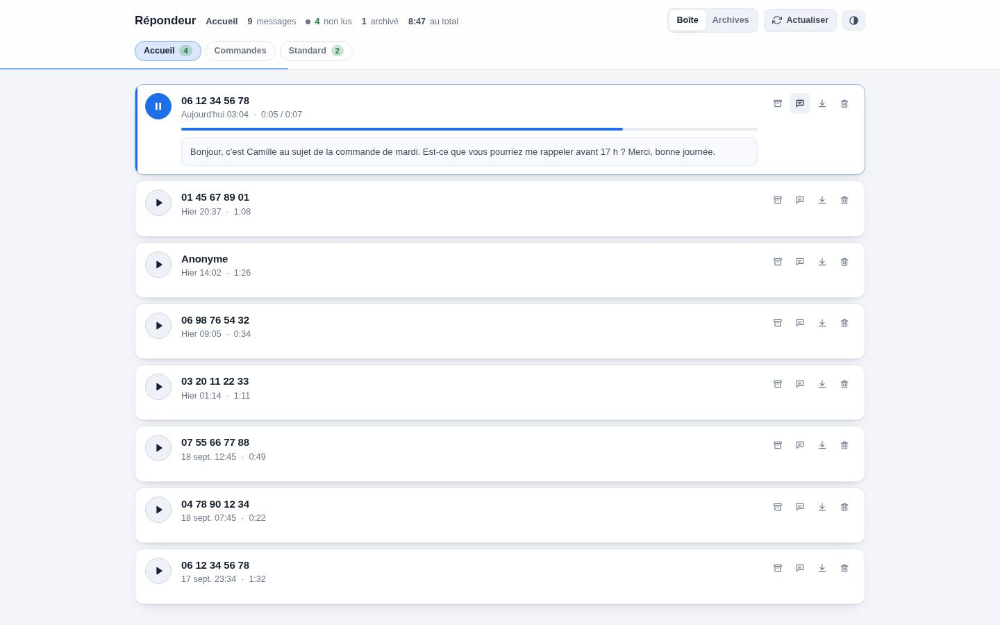

# OVH Simple Voicemail Manager

Listen to, read, download and clean up the voicemails of your OVHcloud
telephony lines from a single page, instead of clicking through the OVHcloud
manager or calling your own number.



Self-hosted, no database, no build step. The interface follows your browser for
the language (French or English) and for light or dark:



## Install

You need PHP 8.2 or later, Composer, and somewhere to serve the folder from.

```bash
git clone https://github.com/carsso/ovh-simple-voicemail-manager.git
cd ovh-simple-voicemail-manager
composer install
cp .env.example .env
```

### Give it access to your lines

Open `.env` and fill in one of the two credential sets. The app needs `GET`,
`POST` and `DELETE` on `/telephony/*`, and nothing else.

**An OAuth2 service account** — what OVHcloud issues today, available on the
`ovh-eu`, `ovh-ca` and `ovh-us` endpoints. Create one under
[API credentials](https://www.ovh.com/manager/#/dedicated/useraccount/api-credentials)
and copy the pair:

```dotenv
OVH_CLIENT_ID=
OVH_CLIENT_SECRET=
```

**Or an application token** — the older scheme, still supported and the only
one on So you Start and Kimsufi. Generate it on
[createToken](https://eu.api.ovh.com/createToken/) with the three rights above:

```dotenv
OVH_APPLICATION_KEY=
OVH_APPLICATION_SECRET=
OVH_CONSUMER_KEY=
```

Outside Europe, set `OVH_ENDPOINT` accordingly (`ovh-ca`, `ovh-us`,
`soyoustart-eu`, `kimsufi-eu`…).

Then check the credentials without opening a browser:

```bash
php api.php
```

It prints every line it can see, with its unread count. An error here means the
credentials are wrong or lack a right.

### Run it

```bash
php -S localhost:8080 router.php
```

Open <http://localhost:8080/>. Pass `router.php`: without it the built-in
server hands out `.env` and your cached recordings as plain files.

For anything beyond local use, point Apache at the folder — the shipped
`.htaccess` sets the index and blocks `.env` and `data/`. The built-in server
handles one request at a time, which is noticeable when a recording is being
fetched.

## Using it

Each line you own is a tab, with the number of unread messages the voicemail
reports. Messages come newest first, with the caller, when they called and how
long they talked.

| Button | What it does |
|---|---|
| **Play** | One message at a time. Click the progress bar to jump, or focus it and use ← →. |
| **Transcript** | Shows the speech-to-text, when the line has the option. |
| **Download** | Saves the recording. |
| **Archive** | Moves the message out of the inbox without deleting it. The *Archive* tab holds them, and the same button puts one back. |
| **Delete** | For good. It asks first. |

The list refreshes itself every minute. `r` or the *Refresh* button does it
immediately.

### About the unread count

OVHcloud tells the app *how many* messages are unread on a line, never *which*
ones — so the count is shown in the header and on each tab, but no message is
flagged individually. Playing a message here does not change that count; only
listening from the phone does. *Archive* is the app's own way of keeping the
inbox down to what still needs attention.

## Configuration

Everything lives in `.env`, and real environment variables override it. All of
these are optional:

| Variable | Default | What it does |
|---|---|---|
| `OVH_ENDPOINT` | `ovh-eu` | Which OVHcloud API to talk to. |
| `BILLING_ACCOUNTS` | *(all)* | Comma-separated: only show these billing accounts. |
| `VOICEMAILS` | *(all)* | Comma-separated: only show these lines. |
| `AUDIO_FORMAT` | `mp3` | Also `ogg`, `wav`, `aiff`, `au`, `flac`. |
| `AUTH_USER` / `AUTH_PASSWORD` | *(off)* | HTTP basic auth in front of the app. |
| `LINES_TTL` | `300` | How long the line list is cached, in seconds. |
| `MESSAGES_TTL` | `30` | Same for a line's messages. |
| `AUDIO_TTL` | `2592000` | How long downloaded recordings are kept in `data/`. |
| `FILE_WAIT` | `25` | How long to wait for OVHcloud to prepare a recording or transcript. |

Recordings are fetched once and served from `data/` afterwards, so replaying a
message is instant. Delete that folder whenever you want; it refills itself.

## Security

This app reads, archives and deletes your voicemails, and holds credentials to
your OVHcloud account in `.env` next to it. It ships with **no authentication**.
Set `AUTH_USER` / `AUTH_PASSWORD`, or put it behind something that
authenticates, before exposing it anywhere — and remember that `data/` holds
recordings of the messages people left you.

Provided as-is: you are responsible for how you expose your own account.

## Development

```bash
vendor/bin/phpunit   # PHP, with the OVHcloud API mocked
npm test             # frontend helpers — node --test, nothing to install
```

Both run in GitHub Actions, PHPUnit on PHP 8.2 to 8.4. The frontend is plain ES
modules under `assets/`: no bundler, no dependencies, edit and reload.

## License

MIT — see [LICENSE](LICENSE).

## Note

This project is not affiliated with OVHcloud.
